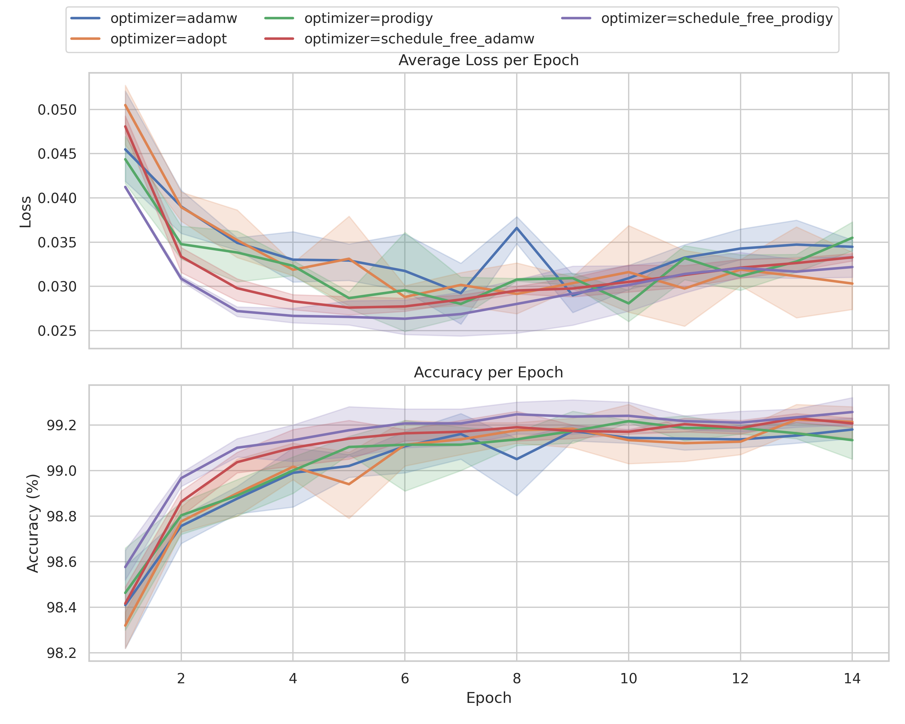
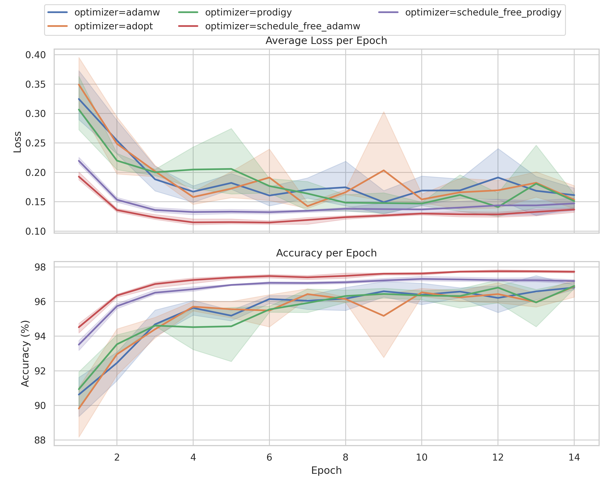

# Tunelex

Tuneless optimizer for Optax and JAX.

This repository explores reimplementing the [`prodigy-plus-schedule-free`](https://github.com/LoganBooker/prodigy-plus-schedule-free) optimizer within Optax.

## Experiment Results

### MNIST

| rank | optimizer             | lr    | batch_size | test_batch_size | epochs | seed_count | accuracy (+/-)      | avg_loss (+/-)     |
|------|-----------------------|-------|------------|-----------------|--------|------------|---------------------|--------------------|
| **1** | schedule_free_prodigy | None | 64         | 1000            | 14     | 3          | 99.2567 +/- 0.0603  | 0.0322 +/- 0.0012  |
| **2** | adopt                 | 0.001 | 64         | 1000            | 14     | 3          | 99.2133 +/- 0.0702  | 0.0303 +/- 0.0033  |
| **3** | schedule_free_adamw   | 0.001 | 64         | 1000            | 14     | 3          | 99.2067 +/- 0.0208  | 0.0333 +/- 0.0004  |
| **4** | adamw                 | 0.001 | 64         | 1000            | 14     | 3          | 99.1800 +/- 0.0458  | 0.0345 +/- 0.0012  |
| **5** | prodigy               | None | 64         | 1000            | 14     | 3          | 99.1333 +/- 0.0737  | 0.0355 +/- 0.0017  |

### KMNIST

| rank | optimizer             | lr    | batch_size | test_batch_size | epochs | seed_count | accuracy (+/-)      | avg_loss (+/-)     |
|------|-----------------------|-------|------------|-----------------|--------|------------|---------------------|--------------------|
| **1** | schedule_free_adamw   | 0.001 | 64         | 1000            | 14     | 3          | 97.7400 +/- 0.0854  | 0.1352 +/- 0.0067  |
| **2** | schedule_free_prodigy | None | 64         | 1000            | 14     | 3          | 97.1433 +/- 0.1106  | 0.1573 +/- 0.0229  |
| **3** | prodigy               | None | 64         | 1000            | 14     | 3          | 96.9033 +/- 0.2146  | 0.1511 +/- 0.0118  |
| **4** | adopt                 | 0.001 | 64         | 1000            | 14     | 3          | 96.8733 +/- 0.5387  | 0.1534 +/- 0.0209  |
| **5** | adamw                 | 0.001 | 64         | 1000            | 14     | 3          | 96.8133 +/- 0.1401  | 0.1613 +/- 0.0189  |
| **6** | ano                   | 0.001 | 64         | 1000            | 14     | 1          | 96.4000             | 0.2380             |

Schedule-free Prodigy is the headline result: the zero extra-parameter variant tops the MNIST benchmark and still holds second place on KMNIST, trailing only schedule-free AdamW while matching its simplicity. The schedule-free transform keeps the optimizer competitive without tuning new degrees of freedom.

To regenerate the plots and tables use `python example/mnist/plot_metrics.py` for MNIST and `python example/kmnist/plot_metrics.py` for KMNIST. The scripts read logged metrics, render plots under `logs/`, and persist the tabular summaries alongside the images in `imgs/`.

